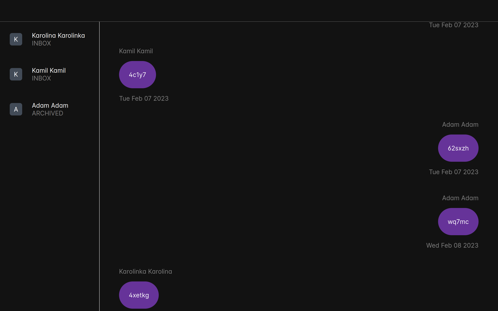

# facebook-messenger-archive-viewer-ui

A simple application written in ♥️ Vue and ♥️ TypeScript. 
It is used to display data generated by [facebook-messenger-archive-viewer](https://www.github.com/kacperfaber/facebook-messenger-archive-viewer). 
Generally, it is its submodule.

Of course, it's not finished.

Kacper Faber